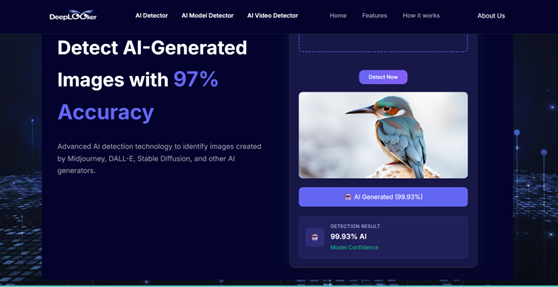
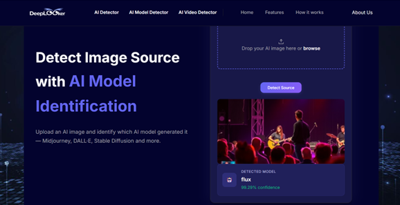
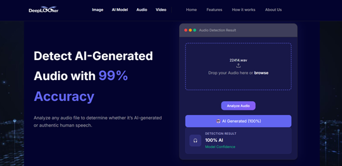
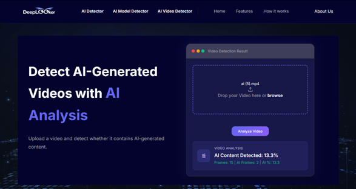

<-----------MULTI-MODAL AI CONTENT DETECTOR--------->

A CNN-based web application designed to detect and analyze AI-generated content across multiple formats, including images, audio, and videos. The system helps identify whether digital content is real or AI-generated and also determines the source AI model used for image generation.

---

## Features

- **AI Image Detection**
  - Classifies images as **Real** or **AI-generated**
  - Uses a custom-trained Convolutional Neural Network (CNN)

- **AI Model Detection**
  - Identifies the source model of AI-generated images
  - Supports models such as:
    - DALL·E  
    - MidJourney  
    - Stable Diffusion  
    - Flux  
  - Built using transfer learning (ResNet50)

- **AI Audio Detection**
  - Converts audio into spectrograms using Librosa  
  - Analyzes frequency patterns and voice characteristics  
  - Classifies audio as **Real** or **AI-generated**

- **AI Video Detection**
  - Extracts frames using OpenCV
  - Performs frame-by-frame analysis using CNN
  - Calculates percentage of AI-generated content

---

## Tech Stack

- **Backend:** Flask (Python)  
- **Machine Learning:** TensorFlow, Keras  
- **Audio Processing:** Librosa  
- **Computer Vision:** OpenCV  
- **Frontend:** HTML, CSS, JavaScript  
- **Image Processing:** Pillow, NumPy  

---

## Project Structure

multi-modal-ai-detector/
│
├── app.py  
├── train.py  
├── train2.py  
├── train3.py  
├── requirements.txt  
├── README.md  
│
├── model.h5  
├── model_audio.h5  
├── model_module2.h5  
│
├── static/  
│   ├── css/  
│   ├── js/  
│   ├── images/  
│
├── templates/  
│   ├── home.html  
│   ├── modelch.html  
│   ├── vid.html  
│   ├── aud.html  
│   ├── about.html  
│   ├── navbar.html  
│   └── footer.html  

---

## How to Run Locally

1. Clone the repository:
   ```bash
   git clone https://github.com/your-username/multi-modal-ai-detector.git
   ```

2. Navigate to the project folder:
   ```bash
   cd multi-modal-ai-detector
   ```

3. Install dependencies:
   ```bash
   pip install -r requirements.txt
   ```

4. Run the application:
   ```bash
   python app.py
   ```

5. Open in browser:
   ```
   http://127.0.0.1:5000/
   ```

---

## Screenshots

AI Image Detection  


AI Model Detection  


AI Audio Detection  


AI Video Detection  


---

## Note

Due to GitHub file size limitations, large model files such as `.h5` models are not included in the repository. The system is designed to load these models during runtime.

---

## Future Enhancements

- Improve model accuracy with larger datasets  
- Optimize video and audio processing speed  
- Deploy full working system with hosted models  
- Add real-time detection API  
- Extend detection to newer AI generation techniques  

---

## Author

**Aseera Parveen J**  
Multi-Modal AI Detection System  

---

## License

This project is developed for academic purposes.
